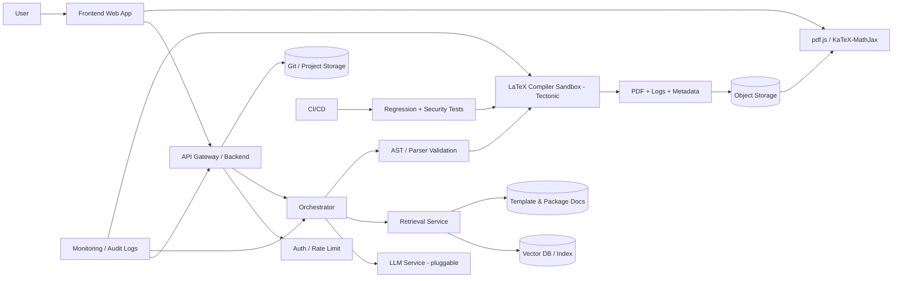
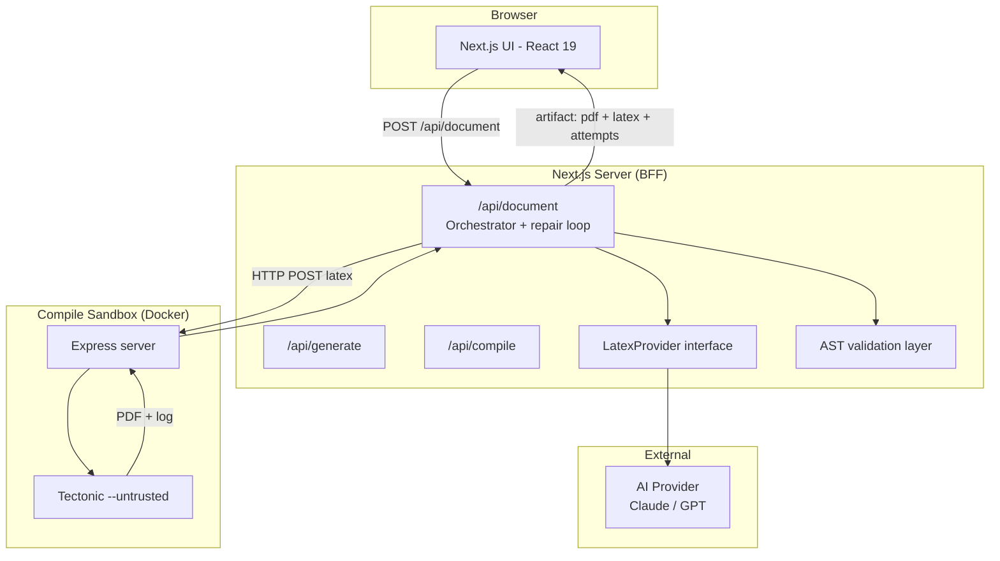
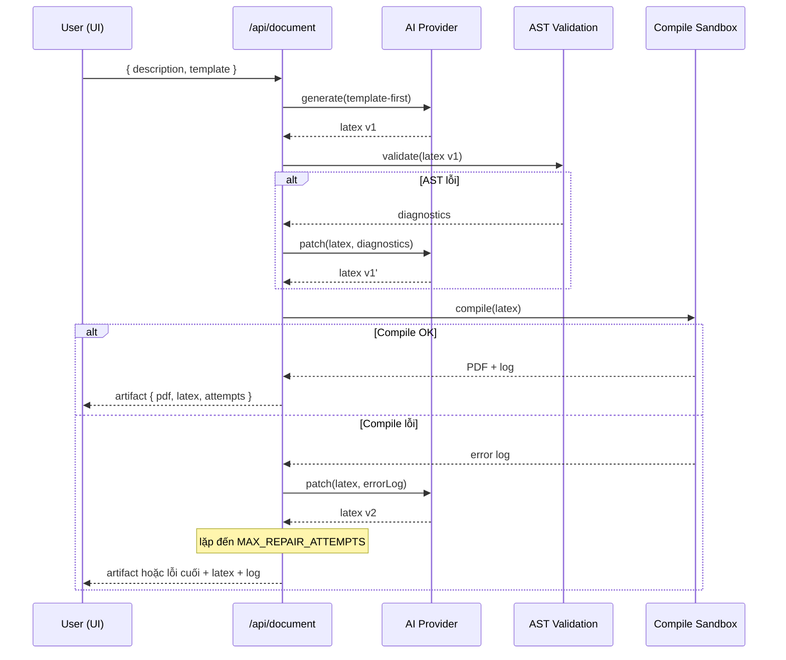
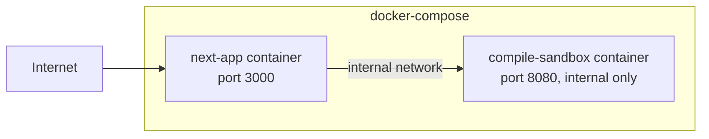

# 03 — Kiến trúc hệ thống

## 3.0. Nguyên tắc thiết kế (design principles)

Theo nghiên cứu sâu, "AI sinh LaTeX" là bài toán **kỹ nghệ tài liệu**, không phải sinh text thuần.
Thiết kế hợp lý nhất là: **template-first, LLM-assisted, retrieval-grounded, AST-validated,
compiler-in-the-loop, sandbox-protected**.

> **Châm ngôn:** *"LLM viết; parser kiểm; compiler xác nhận; sandbox bảo vệ; retrieval giữ chuẩn."*

| Nguyên tắc | Ý nghĩa | MVP? |
|-----------|---------|------|
| Template-first | Sinh nội dung vào khung template thay vì tự do → ổn định, ít variance | ✅ |
| LLM-assisted | LLM sinh/sửa nội dung, nhưng không phải nguồn sự thật cuối | ✅ |
| AST-validated | Parse/validate trước compile để bắt sớm lỗi cấu trúc (best-effort) | ✅ |
| Compiler-in-the-loop | Compiler là **nguồn sự thật vận hành**; log dẫn dắt vòng sửa | ✅ |
| Sandbox-protected | Compile input không tin cậy trong container cô lập (`--untrusted`) | ✅ |
| Retrieval-grounded (RAG) | Grounding vào template/package docs/project để giảm hallucination | 🔜 v1 |

## 3.1. Kiến trúc mục tiêu (target reference architecture)

Đây là kiến trúc đầy đủ định hướng v1/v2. **MVP chỉ hiện thực một subset** (xem §3.2).



**Giải thích:** Orchestrator quyết định khi nào gọi retrieval, khi nào sinh mới, khi nào patch tệp
hiện có. Output đi qua AST validation rồi mới vào compiler sandbox. Compiler trả PDF + logs + diagnostics
→ lưu artifact + preview qua pdf.js. CI/CD chạy regression compile suite + security tests mỗi khi đổi
model/prompt/template để không làm gãy project cũ.

## 3.2. Subset cho MVP

MVP gồm **2 service** ghép qua `docker-compose`, hiện thực phần lõi của kiến trúc mục tiêu:



**MVP có:** template-first generation, AST validation, compiler-in-the-loop (repair), sandbox.
**MVP chưa có (v1/v2):** RAG/Vector DB, Git/project storage, auth, CI regression suite, monitoring đầy đủ,
multi-file editing, conversion, OCR.

## 3.3. Thành phần (MVP)

### 3.3.1. Next.js app
- **UI layer** (`app/`): form nhập, chọn template, preview PDF, hiển thị source, trạng thái.
- **API routes (BFF):**
  - `/api/generate` — gọi AI sinh LaTeX (không compile).
  - `/api/compile` — gọi compile sandbox.
  - `/api/document` — **orchestrator**: generate → AST validate → compile → patch loop. Endpoint chính.
- **AST validation layer** — parse/validate trước khi compile (tree-sitter-latex / unified-latex / latex-utensils).
- **Provider abstraction** — `LatexProvider` interface (Claude/GPT/Mock).

### 3.3.2. Compile sandbox
- Microservice độc lập (Node + Express), cài **Tectonic**, chạy chế độ `--untrusted`.
- Endpoint `POST /compile` nhận `{ latex }`, trả PDF + log hoặc `{ success:false, log }`.
- Chạy non-root, container cô lập, timeout & giới hạn tài nguyên (xem [07](./07-compile-service.md)).

### 3.3.3. AI Provider (ngoài)
- Claude/GPT, chọn qua env `AI_PROVIDER`. Chỉ gọi server-side; API key không tới client.

## 3.4. Luồng dữ liệu chính (generate → validate → compile → patch)



## 3.5. Hợp đồng dữ liệu (tóm tắt — chi tiết ở [05-backend.md](./05-backend.md))

```ts
type DocType = 'article' | 'report';   // = template ở MVP

interface DocumentRequest {
  description: string;
  docType: DocType;
}

// Artifact trả về (success)
interface DocumentResponse {
  latex: string;            // mã LaTeX cuối cùng
  pdfBase64: string;        // PDF
  attempts: number;         // số lần generate/compile
  metadata?: {              // metadata gói artifact
    engine: string;         // tectonic (xetex)
    packages?: string[];
    template: DocType;
  };
  log?: string;             // log compile (rút gọn)
}

interface DocumentError {
  error: string;
  latex?: string;
  log?: string;
  attempts: number;
}
```

## 3.6. Tech stack & lý do chọn

| Lớp | Công nghệ | Lý do |
|-----|-----------|-------|
| Frontend | Next.js 16 + React 19 + Tailwind 4 | Đã khởi tạo sẵn; App Router + Server Components hợp BFF |
| Ngôn ngữ | TypeScript | An toàn kiểu, hợp đồng dữ liệu rõ ràng |
| AI | Claude / GPT qua interface | Chất lượng sinh LaTeX tốt; provider-agnostic |
| Validation | tree-sitter-latex / unified-latex / latex-utensils | Parse/validate AST trước compile (best-effort) |
| Compile | Tectonic `--untrusted` | Tự tải package, compile đa pass, cache, mode untrusted, dễ Docker hóa |
| Preview | pdf.js + KaTeX/MathJax | PDF + math preview phía web (phase sau) |
| Đóng gói | Docker + docker-compose | Cô lập compile, ghép service, dễ chạy local & deploy |
| Test | Vitest + React Testing Library | Nhanh, hợp hệ sinh thái TS/React |

### Vì sao Tectonic (server-side) thay vì WASM?
- Bài toán là **tài liệu đầy đủ** → cần đầy đủ package, ổn định cho article/report.
- Tectonic tự động tải package, compile thông minh, có cache và chế độ `--untrusted` cho input không tin cậy.
- WASM (SwiftLaTeX) nhẹ hạ tầng nhưng hạn chế package, nặng tải engine/font phía client — hợp preview snippet hơn.

## 3.7. Triển khai (deployment topology)



- `compile-sandbox` **không expose ra Internet**, chỉ Next.js gọi qua mạng nội bộ compose.
- Env: `COMPILE_SERVICE_URL`, `AI_PROVIDER`, `AI_API_KEY`, `MAX_REPAIR_ATTEMPTS`...
- Mô hình tham chiếu: Overleaf dùng **sandboxed compiles bằng container riêng cho mỗi project**;
  ta áp dụng nguyên tắc cô lập tương tự ở mức request.

## 3.8. Quyết định kiến trúc (ADR tóm tắt)

| Quyết định | Lựa chọn | Đánh đổi |
|-----------|----------|----------|
| Khung bài toán | Document engineering pipeline | Phức tạp hơn "gọi LLM"; đổi lại độ tin cậy cao |
| Compile engine | Tectonic server-side, `--untrusted` | Cần hạ tầng Docker; đổi lại đầy đủ, ổn định, an toàn |
| Tách compile sandbox | Microservice riêng | Thêm 1 service; đổi lại cô lập bảo mật, scale độc lập |
| AST validation | Có (best-effort) trước compile | Thêm 1 lớp; đổi lại bắt lỗi sớm, tiết kiệm lượt compile |
| AI provider | Provider-agnostic interface | Thêm lớp trừu tượng; đổi lại không khoá nhà cung cấp |
| RAG | Hoãn tới v1 | MVP có thể hallucinate hơn; đổi lại ra MVP nhanh |
| State | Stateless (MVP) | Không lưu lịch sử; đổi lại đơn giản |
