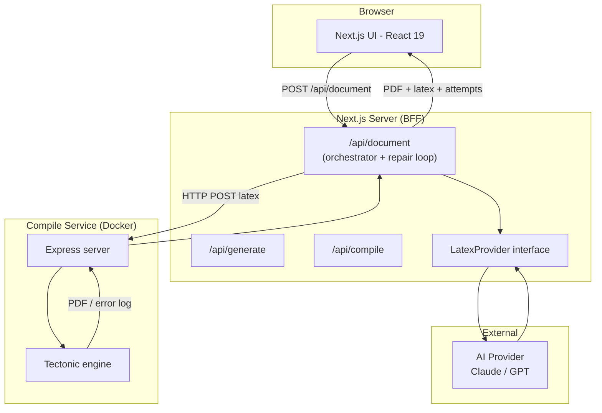
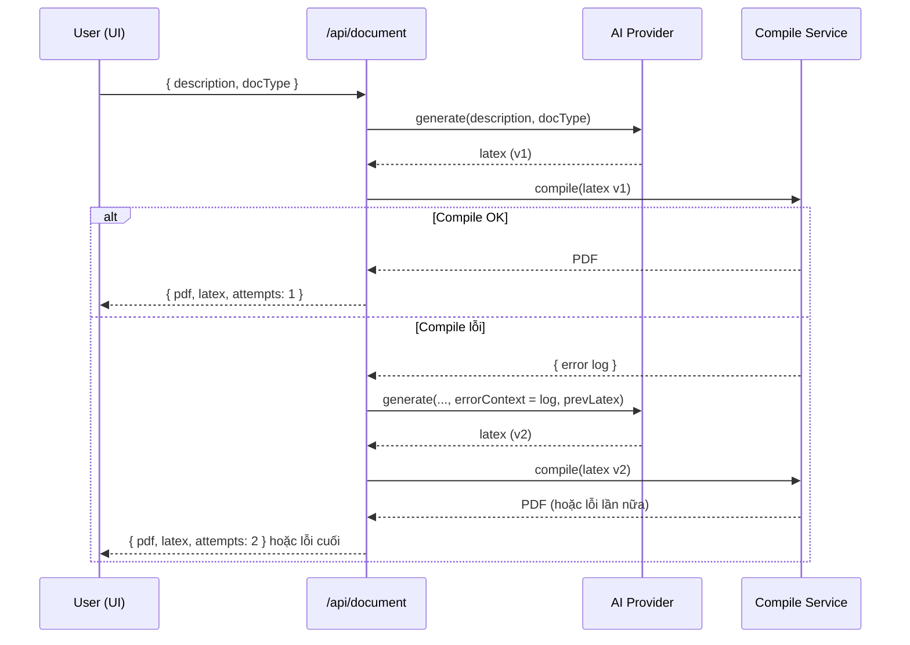
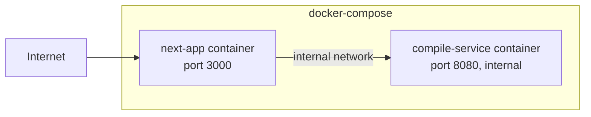

# 03 — Kiến trúc hệ thống

## 3.1. Tổng quan

Hệ thống gồm **2 service** ghép qua `docker-compose`:

1. **Next.js app** (Frontend + BFF/API routes) — giao diện người dùng và lớp điều phối (orchestrator).
2. **Compile service** (Node + Tectonic trong Docker) — nhận LaTeX, trả PDF hoặc log lỗi.

AI provider là dịch vụ ngoài (Anthropic/OpenAI), gọi từ Next.js server-side qua một interface trừu tượng.



## 3.2. Thành phần

### 3.2.1. Next.js app
- **UI layer** (`app/`): form nhập, preview PDF, hiển thị source, trạng thái.
- **API routes** (BFF):
  - `/api/generate` — gọi AI sinh LaTeX (không compile).
  - `/api/compile` — gọi compile service.
  - `/api/document` — **orchestrator**: ghép generate + compile + repair loop. Đây là endpoint
    chính UI gọi.
- **Provider abstraction**: `LatexProvider` interface, các implementation (Claude/GPT/Mock).

> Ghi chú thiết kế: `/api/generate` và `/api/compile` tách riêng giúp test từng phần và tái sử dụng;
> `/api/document` là luồng người dùng dùng thật. Có thể giữ generate/compile làm internal hoặc public tuỳ nhu cầu.

### 3.2.2. Compile service
- Microservice độc lập (Node + Express), **không phụ thuộc Next.js**.
- Cài Tectonic trong image Docker.
- Endpoint `POST /compile` nhận `{ latex }`, trả PDF (binary) hoặc `{ success:false, log }`.
- Chạy non-root, sandbox, có timeout & giới hạn tài nguyên.

### 3.2.3. AI Provider (ngoài)
- Anthropic Claude hoặc OpenAI GPT, chọn qua env `AI_PROVIDER`.
- Chỉ gọi từ server-side; API key không bao giờ tới client.

## 3.3. Luồng dữ liệu chính (happy path + repair)



## 3.4. Hợp đồng dữ liệu (tóm tắt — chi tiết ở [05-backend.md](./05-backend.md))

```ts
type DocType = 'article' | 'report';

// /api/document  (request)
interface DocumentRequest {
  description: string;
  docType: DocType;
}

// /api/document  (response - success)
interface DocumentResponse {
  latex: string;        // mã LaTeX cuối cùng
  pdfBase64: string;    // hoặc trả PDF binary stream tuỳ thiết kế
  attempts: number;     // số lần đã thử compile
}

// /api/document  (response - error)
interface DocumentError {
  error: string;        // thông điệp thân thiện
  latex?: string;       // mã LaTeX gần nhất (để user tự xử lý)
  log?: string;         // log compile lần cuối (rút gọn)
  attempts: number;
}
```

## 3.5. Tech stack & lý do chọn

| Lớp | Công nghệ | Lý do |
|-----|-----------|-------|
| Frontend | Next.js 16 + React 19 + Tailwind 4 | Đã khởi tạo sẵn; App Router + Server Components phù hợp BFF |
| Ngôn ngữ | TypeScript | An toàn kiểu, hợp đồng dữ liệu rõ ràng |
| AI | Claude / GPT qua interface | Chất lượng sinh LaTeX tốt; provider-agnostic để linh hoạt |
| Compile | Tectonic | Tự tải package, compile đa pass thông minh, dễ đóng gói Docker |
| Đóng gói | Docker + docker-compose | Cô lập compile, ghép 2 service, dễ chạy local & deploy |
| Test | Vitest + React Testing Library | Nhanh, hợp hệ sinh thái TS/React |

### Vì sao Tectonic (server-side) thay vì WASM?
- Bài toán là **tài liệu đầy đủ** → cần đầy đủ package, ổn định cho article/report.
- Tectonic tự động tải package cần thiết, không phải bundle sẵn cả TeX Live.
- WASM (SwiftLaTeX) nhẹ hạ tầng nhưng hạn chế package, nặng tải engine/font phía client —
  phù hợp hơn cho preview snippet, không phải document đầy đủ.

## 3.6. Triển khai (deployment topology)



- `compile-service` **không expose ra Internet**, chỉ Next.js gọi qua mạng nội bộ của compose.
- Biến môi trường: `COMPILE_SERVICE_URL`, `AI_PROVIDER`, `AI_API_KEY`, `MAX_REPAIR_ATTEMPTS`...

## 3.7. Quyết định kiến trúc (ADR tóm tắt)

| Quyết định | Lựa chọn | Đánh đổi |
|-----------|----------|----------|
| Compile engine | Tectonic server-side | Cần hạ tầng Docker, lo sandbox; đổi lại đầy đủ & ổn định |
| Tách compile service | Microservice riêng | Thêm 1 service; đổi lại cô lập bảo mật, scale độc lập |
| AI provider | Provider-agnostic interface | Thêm lớp trừu tượng; đổi lại không khoá nhà cung cấp |
| State | Stateless (MVP) | Không lưu lịch sử; đổi lại đơn giản, nhanh ra MVP |
| Repair loop | Có, tối đa N lần | Tốn thêm lượt gọi AI; đổi lại tỷ lệ ra PDF cao hơn nhiều |
