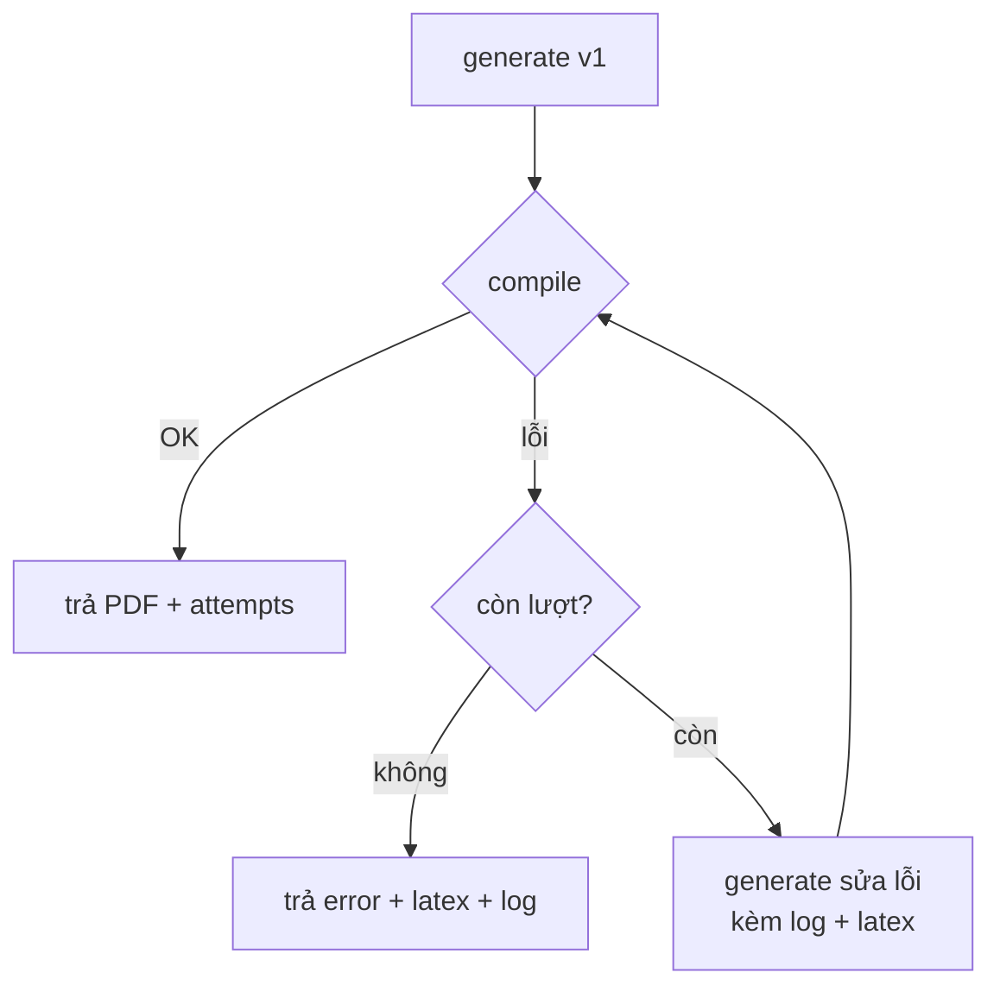

# 05 — Thiết kế Backend & API

Backend nằm trong Next.js (App Router Route Handlers) đóng vai trò **BFF/orchestrator**,
cộng với **compile service** tách riêng (mô tả ở [07-compile-service.md](./07-compile-service.md)).

## 5.1. Tổng quan API

| Endpoint | Method | Vai trò | Public? |
|----------|--------|---------|---------|
| `/api/documents` | GET | Liệt kê tài liệu đã lưu (summary). | Có |
| `/api/documents` | POST | Tạo mới: orchestrator (generate → compile → repair) + **lưu trữ**. **UI dùng khi tạo.** | Có |
| `/api/documents/[id]` | GET | Đọc một tài liệu (kèm latex, pdf, lịch sử chat). | Có |
| `/api/documents/[id]` | PATCH | Sửa tiêu đề, hoặc sửa mã LaTeX thủ công → validate + recompile. | Có |
| `/api/documents/[id]` | DELETE | Xoá tài liệu. | Có |
| `/api/documents/[id]/chat` | POST | **Chat-edit**: chỉ thị → AI sửa LaTeX → validate → compile → lưu. | Có |
| `/api/document` | POST | Orchestrator **stateless** (không lưu). Nội bộ/test, giữ tương thích. | Tuỳ chọn |
| `/api/generate` | POST | Chỉ sinh LaTeX (không compile). Hữu ích để test/tái dùng. | Tuỳ chọn |
| `/api/compile` | POST | Chỉ compile LaTeX → PDF (gọi compile service). | Tuỳ chọn |

> UI ở MVP dùng **`/api/documents*`** (có lưu trữ) cho luồng chính: tạo → xem → sửa (thủ công/chat) → xoá.
> `/api/document`, `/api/generate`, `/api/compile` giữ làm module nội bộ + endpoint phục vụ test.
> Chi tiết CRUD + chat-edit + store xem §5.11.

## 5.2. Kiểu dữ liệu dùng chung

```ts
// types/document.ts
export type DocType = 'article' | 'report';

export interface DocumentRequest {
  description: string;   // mô tả ngôn ngữ tự nhiên
  docType: DocType;
}

export interface GenerateResult {
  latex: string;
}

export interface CompileSuccess {
  success: true;
  pdf: Buffer;           // hoặc Uint8Array
}

export interface CompileFailure {
  success: false;
  log: string;           // log lỗi từ Tectonic (đã rút gọn)
}

export type CompileResult = CompileSuccess | CompileFailure;
```

## 5.3. `/api/generate`

**Request**
```json
{ "description": "Báo cáo về năng lượng mặt trời, có mở đầu, 3 phần, kết luận", "docType": "report" }
```

**Xử lý**
1. Validate input: `description` không rỗng (hoặc có ≥1 file nguồn), độ dài ≤ `MAX_INPUT_CHARS`
   (mặc định 20.000 ký tự); `docType ∈ {article, report}`.
2. Lấy provider qua factory (`getProvider()` đọc env `AI_PROVIDER`).
3. Gọi `provider.generate({ description, docType })`.
4. Trả `{ latex }`.

**Response thành công** `200`
```json
{ "latex": "\\documentclass{report}\n..." }
```

**Lỗi**: `400` (input sai), `502` (provider lỗi), `429` (rate limit), `500` (khác).

## 5.4. `/api/compile`

**Request**
```json
{ "latex": "\\documentclass{article}..." }
```

**Xử lý**
1. Validate `latex` không rỗng, ≤ giới hạn kích thước.
2. `POST {COMPILE_SERVICE_URL}/compile` với `{ latex }`.
3. Nếu service trả PDF → trả PDF cho client.
4. Nếu service trả lỗi → trả `{ success:false, log }`.

**Response thành công**: PDF binary (`Content-Type: application/pdf`) hoặc bọc base64
trong JSON tuỳ thiết kế (xem 5.7).

## 5.5. `/api/document` (orchestrator + repair loop)

Đây là trái tim sản phẩm. Pseudocode:

```ts
async function handleDocument(req: DocumentRequest): Promise<DocumentResponse | DocumentError> {
  const maxAttempts = Number(process.env.MAX_REPAIR_ATTEMPTS ?? 3);
  const provider = getProvider();

  let latex = (await provider.generate({
    description: req.description,
    docType: req.docType,
  })).latex;

  let lastLog = '';

  for (let attempt = 1; attempt <= maxAttempts; attempt++) {
    const result = await compile(latex);            // gọi compile service
    if (result.success) {
      return { latex, pdfBase64: toBase64(result.pdf), attempts: attempt };
    }
    lastLog = result.log;
    if (attempt === maxAttempts) break;             // hết lượt

    // repair: đưa log lỗi + latex hiện tại cho AI sửa
    latex = (await provider.generate({
      description: req.description,
      docType: req.docType,
      errorContext: { previousLatex: latex, errorLog: result.log },
    })).latex;
  }

  return {
    error: 'Không tạo được PDF sau nhiều lần thử. Bạn có thể chỉnh mã LaTeX dưới đây.',
    latex,
    log: truncate(lastLog),
    attempts: maxAttempts,
  };
}
```

**Đặc tả hành vi**
- Số lần thử = `MAX_REPAIR_ATTEMPTS` (mặc định 3 → 1 lần đầu + tối đa 2 lần sửa).
- Mỗi lần sửa, đưa **mã LaTeX trước đó** + **log lỗi** cho provider (xem [06-ai-integration.md](./06-ai-integration.md)).
- Luôn giữ mã LaTeX gần nhất để trả về kể cả khi thất bại (giúp người dùng tự xử lý / mang sang Overleaf).
- Trả `attempts` để UI hiển thị.



## 5.6. Xử lý lỗi & mã trạng thái

| Tình huống | HTTP | Body |
|-----------|------|------|
| Input không hợp lệ | 400 | `{ error }` |
| AI provider lỗi/timeout | 502 | `{ error }` |
| Compile service không phản hồi | 502 | `{ error }` |
| Vượt rate limit | 429 | `{ error }` |
| Repair loop thất bại sau N lần | 200 | `{ error, latex, log, attempts }` |
| Lỗi không xác định | 500 | `{ error }` |

> **QUYẾT ĐỊNH (đã chốt)**: repair-loop-thất-bại trả **`200`** kèm cờ lỗi trong body
> (`{ error, latex, log, attempts }`). Lý do: đây là **kết quả "bình thường" của luồng nghiệp vụ**
> (vẫn sinh ra latex + log hữu ích để người dùng tự xử lý/mang sang Overleaf), không phải lỗi giao
> thức. UI phân biệt success/fail dựa trên sự hiện diện của trường `error`, không dựa HTTP status.
> Các lỗi thực sự (input sai `400`, provider/compile-service lỗi `502`, rate limit `429`, khác `500`)
> vẫn dùng status tương ứng ở bảng trên.

## 5.7. Truyền PDF: base64 vs binary

| Cách | Ưu | Nhược |
|------|----|-------|
| **Base64 trong JSON** | Dễ kèm `latex`, `attempts` cùng response | Phình ~33% dung lượng |
| **Binary stream** | Hiệu quả, đúng `Content-Type` | Khó kèm metadata; cần header riêng cho attempts |

**QUYẾT ĐỊNH (đã chốt cho MVP)**: `/api/document` trả **base64 trong JSON** (vì cần kèm `latex`,
`attempts`, `metadata`, `log` trong cùng một response). `/api/compile` (endpoint thuần compile) trả
**PDF binary** (`Content-Type: application/pdf`) khi thành công, JSON `{ success:false, log }` khi
lỗi. Lý do: tối ưu cho từng use case — orchestrator cần đóng gói nhiều trường nên chấp nhận phình
~33%; endpoint compile thuần ưu tiên hiệu quả truyền tải.

## 5.8. Cấu hình (biến môi trường)

| Biến | Ý nghĩa | Ví dụ |
|------|---------|-------|
| `AI_PROVIDER` | `anthropic` \| `openai` \| `mock` | `anthropic` |
| `AI_API_KEY` | API key của provider | (bí mật) |
| `AI_MODEL` | Model cụ thể | `claude-...` / `gpt-...` |
| `COMPILE_SERVICE_URL` | URL compile service | `http://compile-service:8080` |
| `MAX_REPAIR_ATTEMPTS` | Số lần thử compile | `3` |
| `MAX_INPUT_CHARS` | Giới hạn độ dài mô tả | `20000` |
| `REQUEST_TIMEOUT_MS` | Timeout gọi AI/compile | `60000` |
| `DATA_DIR` | Thư mục lưu trữ tài liệu (file-based) | `.data` (Docker: `/data`) |

Quy tắc: **không log giá trị secret**; chỉ tham chiếu theo tên biến.

> Danh sách env đầy đủ (gồm `AI_BASE_URL`, `AI_MAX_TOKENS`, `MAX_SOURCE_FILES`, `MAX_SOURCE_CHARS`,
> `MAX_PROMPT_SOURCE_CHARS`, `RATE_LIMIT_PER_MINUTE`...) xem [`.env.example`](../.env.example) và
> [11-data-model.md](./11-data-model.md) §11.6.

## 5.9. Rate limiting & lạm dụng

- MVP: rate limit **in-memory** theo IP (vd token bucket đơn giản) cho `/api/document`.
- Giới hạn độ dài input và kích thước LaTeX gửi đi compile.
- Khi mở rộng: chuyển sang store chia sẻ (Redis) để rate limit đúng khi scale nhiều instance.

## 5.10. Kiểm thử Backend

- **Unit**: validate input; provider factory chọn đúng theo env; hàm `truncate`/`toBase64`.
- **Integration `/api/document`** với `MockProvider` + compile service mock:
  - happy path: generate → compile OK → trả PDF, `attempts=1`.
  - repair path: compile lỗi lần 1 → sửa → OK, `attempts=2`.
  - fail path: lỗi đủ N lần → trả `error + latex + log`, `attempts=N`.
- **Integration `/api/compile`**: mock compile service trả PDF / log.

## 5.11. Lưu trữ tài liệu, CRUD & chat-edit

Từ MVP, tài liệu đã sinh được **lưu trữ file-based** để có thể xem lại, chỉnh sửa và xoá.

### 5.11.1. File store (`lib/store/documentStore.ts`)
- Mỗi tài liệu là **một file JSON** trong `${DATA_DIR}/documents/<id>.json`.
- Ghi **atomic** (ghi file tạm → `rename`) để tránh file hỏng khi ghi dở.
- `id` là `randomUUID`; mọi truy cập kiểm **`isValidId`** (chỉ `[A-Za-z0-9_-]`, chống path traversal).
- API: `createDocument`, `getDocument`, `listDocuments` (trả summary, sắp xếp `updatedAt` giảm dần),
  `updateDocument`, `appendMessages`, `deleteDocument`.
- `listDocuments` chịu lỗi thư mục không ghi/đọc được → trả `[]` (không làm sập trang liệt kê).

### 5.11.2. `POST /api/documents` — tạo mới (có lưu trữ)
1. Rate limit theo IP; validate input như `/api/document`.
2. Chạy `runDocument` (orchestrator). Kể cả **thất bại nghiệp vụ** vẫn lưu (latex + log + error) để sửa tiếp.
3. Suy ra `title` (dòng đầu mô tả hoặc tên file nguồn), tạo `StoredDocument`.
4. Trả **`201`** với `StoredDocument`. UI điều hướng tới `/documents/[id]`.

### 5.11.3. `GET /api/documents` — danh sách
- Trả `{ documents: DocumentSummary[] }` (không kèm latex/pdf nặng).

### 5.11.4. `GET|PATCH|DELETE /api/documents/[id]`
- `GET`: `200` `StoredDocument` | `404`.
- `PATCH` `{ title?, latex? }`: sửa tiêu đề; nếu có `latex` thì **validate + compile lại** (không gọi AI).
  Lưu kết quả kể cả khi lỗi (kèm `log`/`error`) để người dùng thấy và sửa tiếp. `200` | `404` | `502` (compile service).
- `DELETE`: `200` `{ ok: true }` | `404`.
- Route dùng chữ ký Next.js 16: `ctx.params` là **Promise** (`const { id } = await ctx.params`).

### 5.11.5. `POST /api/documents/[id]/chat` — chat-edit
1. Rate limit theo IP (mỗi lượt gọi AI). Kiểm tra tài liệu tồn tại và có `latex`.
2. Validate `instruction` (không rỗng, ≤ 4000 ký tự).
3. Gọi `runEdit({ currentLatex, instruction, docType })` → generate(editContext) → validate → compile → repair loop.
4. Nối 2 message (user + assistant) vào lịch sử; nếu thành công cập nhật `latex`/`pdfBase64`,
   nếu thất bại **giữ nguyên** tài liệu cũ (không phá bản đang có) + message cảnh báo.
5. Trả `200` `StoredDocument` (đã cập nhật). Lỗi hạ tầng: `502` nhưng vẫn lưu lịch sử chat.

> Kiểu dữ liệu `StoredDocument`, `ChatMessage`, `DocumentSummary`, `EditRequest` — xem
> [11-data-model.md](./11-data-model.md) §11.1.
