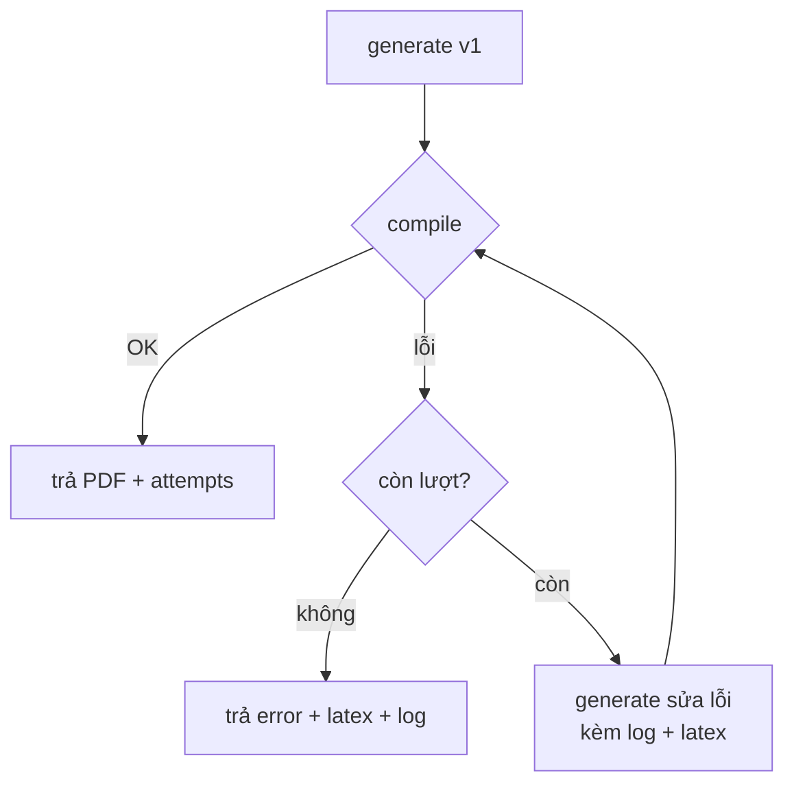

# 05 — Thiết kế Backend & API

Backend nằm trong Next.js (App Router Route Handlers) đóng vai trò **BFF/orchestrator**,
cộng với **compile service** tách riêng (mô tả ở [07-compile-service.md](./07-compile-service.md)).

## 5.1. Tổng quan API

| Endpoint | Method | Vai trò | Public? |
|----------|--------|---------|---------|
| `/api/document` | POST | Orchestrator: generate → compile → repair loop. **Endpoint chính UI dùng.** | Có |
| `/api/generate` | POST | Chỉ sinh LaTeX (không compile). Hữu ích để test/tái dùng. | Tuỳ chọn |
| `/api/compile` | POST | Chỉ compile LaTeX → PDF (gọi compile service). | Tuỳ chọn |

> MVP có thể chỉ phơi `/api/document` ra UI; `/api/generate` và `/api/compile` giữ làm
> module nội bộ + endpoint phục vụ test. Tách rõ để dễ kiểm thử từng phần.

## 5.2. Kiểu dữ liệu dùng chung

```ts
// types/document.ts
export type DocType = 'article' | 'report';

export interface DocumentRequest {
  description: string;   // mô tả ngôn ngữ tự nhiên
  docType: DocType;
}

export interface GenerateResult {
  latex: string;
}

export interface CompileSuccess {
  success: true;
  pdf: Buffer;           // hoặc Uint8Array
}

export interface CompileFailure {
  success: false;
  log: string;           // log lỗi từ Tectonic (đã rút gọn)
}

export type CompileResult = CompileSuccess | CompileFailure;
```

## 5.3. `/api/generate`

**Request**
```json
{ "description": "Báo cáo về năng lượng mặt trời, có mở đầu, 3 phần, kết luận", "docType": "report" }
```

**Xử lý**
1. Validate input: `description` không rỗng, độ dài ≤ giới hạn (vd 5.000 ký tự); `docType ∈ {article, report}`.
2. Lấy provider qua factory (`getProvider()` đọc env `AI_PROVIDER`).
3. Gọi `provider.generate({ description, docType })`.
4. Trả `{ latex }`.

**Response thành công** `200`
```json
{ "latex": "\\documentclass{report}\n..." }
```

**Lỗi**: `400` (input sai), `502` (provider lỗi), `429` (rate limit), `500` (khác).

## 5.4. `/api/compile`

**Request**
```json
{ "latex": "\\documentclass{article}..." }
```

**Xử lý**
1. Validate `latex` không rỗng, ≤ giới hạn kích thước.
2. `POST {COMPILE_SERVICE_URL}/compile` với `{ latex }`.
3. Nếu service trả PDF → trả PDF cho client.
4. Nếu service trả lỗi → trả `{ success:false, log }`.

**Response thành công**: PDF binary (`Content-Type: application/pdf`) hoặc bọc base64
trong JSON tuỳ thiết kế (xem 5.7).

## 5.5. `/api/document` (orchestrator + repair loop)

Đây là trái tim sản phẩm. Pseudocode:

```ts
async function handleDocument(req: DocumentRequest): Promise<DocumentResponse | DocumentError> {
  const maxAttempts = Number(process.env.MAX_REPAIR_ATTEMPTS ?? 3);
  const provider = getProvider();

  let latex = (await provider.generate({
    description: req.description,
    docType: req.docType,
  })).latex;

  let lastLog = '';

  for (let attempt = 1; attempt <= maxAttempts; attempt++) {
    const result = await compile(latex);            // gọi compile service
    if (result.success) {
      return { latex, pdfBase64: toBase64(result.pdf), attempts: attempt };
    }
    lastLog = result.log;
    if (attempt === maxAttempts) break;             // hết lượt

    // repair: đưa log lỗi + latex hiện tại cho AI sửa
    latex = (await provider.generate({
      description: req.description,
      docType: req.docType,
      errorContext: { previousLatex: latex, errorLog: result.log },
    })).latex;
  }

  return {
    error: 'Không tạo được PDF sau nhiều lần thử. Bạn có thể chỉnh mã LaTeX dưới đây.',
    latex,
    log: truncate(lastLog),
    attempts: maxAttempts,
  };
}
```

**Đặc tả hành vi**
- Số lần thử = `MAX_REPAIR_ATTEMPTS` (mặc định 3 → 1 lần đầu + tối đa 2 lần sửa).
- Mỗi lần sửa, đưa **mã LaTeX trước đó** + **log lỗi** cho provider (xem [06-ai-integration.md](./06-ai-integration.md)).
- Luôn giữ mã LaTeX gần nhất để trả về kể cả khi thất bại (giúp người dùng tự xử lý / mang sang Overleaf).
- Trả `attempts` để UI hiển thị.



## 5.6. Xử lý lỗi & mã trạng thái

| Tình huống | HTTP | Body |
|-----------|------|------|
| Input không hợp lệ | 400 | `{ error }` |
| AI provider lỗi/timeout | 502 | `{ error }` |
| Compile service không phản hồi | 502 | `{ error }` |
| Vượt rate limit | 429 | `{ error }` |
| Repair loop thất bại sau N lần | 200 hoặc 422 | `{ error, latex, log, attempts }` |
| Lỗi không xác định | 500 | `{ error }` |

> Quyết định: repair-loop-thất-bại trả `200` với cờ lỗi (vì là kết quả "bình thường" của luồng)
> hoặc `422 Unprocessable`. Chốt cụ thể khi code; UI xử lý cả hai dựa trên trường `error`.

## 5.7. Truyền PDF: base64 vs binary

| Cách | Ưu | Nhược |
|------|----|-------|
| **Base64 trong JSON** | Dễ kèm `latex`, `attempts` cùng response | Phình ~33% dung lượng |
| **Binary stream** | Hiệu quả, đúng `Content-Type` | Khó kèm metadata; cần header riêng cho attempts |

**Đề xuất MVP**: base64 trong JSON cho `/api/document` (vì cần kèm `latex` + `attempts`);
endpoint `/api/compile` thuần có thể trả binary.

## 5.8. Cấu hình (biến môi trường)

| Biến | Ý nghĩa | Ví dụ |
|------|---------|-------|
| `AI_PROVIDER` | `anthropic` \| `openai` \| `mock` | `anthropic` |
| `AI_API_KEY` | API key của provider | (bí mật) |
| `AI_MODEL` | Model cụ thể | `claude-...` / `gpt-...` |
| `COMPILE_SERVICE_URL` | URL compile service | `http://compile-service:8080` |
| `MAX_REPAIR_ATTEMPTS` | Số lần thử compile | `3` |
| `MAX_INPUT_CHARS` | Giới hạn độ dài mô tả | `5000` |
| `REQUEST_TIMEOUT_MS` | Timeout gọi AI/compile | `60000` |

Quy tắc: **không log giá trị secret**; chỉ tham chiếu theo tên biến.

## 5.9. Rate limiting & lạm dụng

- MVP: rate limit **in-memory** theo IP (vd token bucket đơn giản) cho `/api/document`.
- Giới hạn độ dài input và kích thước LaTeX gửi đi compile.
- Khi mở rộng: chuyển sang store chia sẻ (Redis) để rate limit đúng khi scale nhiều instance.

## 5.10. Kiểm thử Backend

- **Unit**: validate input; provider factory chọn đúng theo env; hàm `truncate`/`toBase64`.
- **Integration `/api/document`** với `MockProvider` + compile service mock:
  - happy path: generate → compile OK → trả PDF, `attempts=1`.
  - repair path: compile lỗi lần 1 → sửa → OK, `attempts=2`.
  - fail path: lỗi đủ N lần → trả `error + latex + log`, `attempts=N`.
- **Integration `/api/compile`**: mock compile service trả PDF / log.
