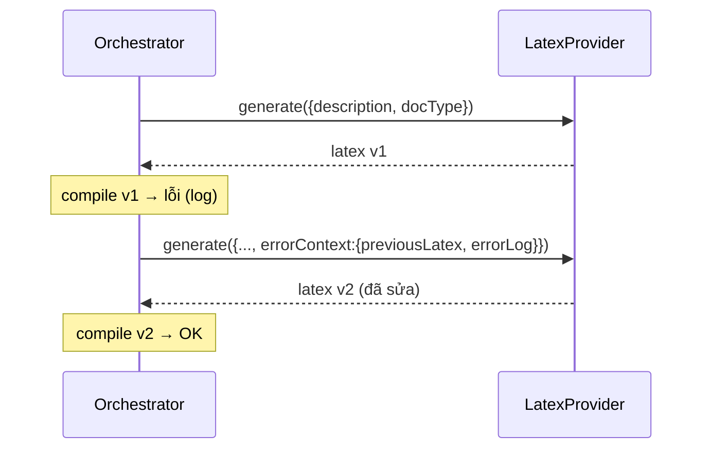

# 06 — Tích hợp AI

## 6.1. Nguyên tắc: Provider-agnostic

AI provider ẩn sau **một interface duy nhất**. Code nghiệp vụ (orchestrator) chỉ biết
interface, không biết đó là Claude, GPT hay Mock. Đổi provider = đổi biến môi trường.

```ts
// ai/types.ts
export interface ErrorContext {
  previousLatex: string;   // mã LaTeX lần trước (compile lỗi)
  errorLog: string;        // log lỗi từ Tectonic
}

export interface GenerateInput {
  description: string;
  docType: 'article' | 'report';
  errorContext?: ErrorContext;   // có => đây là lượt sửa lỗi
}

export interface LatexProvider {
  readonly name: string;
  generate(input: GenerateInput): Promise<{ latex: string }>;
}
```

```ts
// ai/factory.ts
export function getProvider(): LatexProvider {
  switch (process.env.AI_PROVIDER) {
    case 'anthropic': return new AnthropicProvider();
    case 'openai':    return new OpenAIProvider();
    case 'mock':      return new MockProvider();
    default:          throw new Error('AI_PROVIDER không hợp lệ');
  }
}
```

## 6.2. Các implementation

| Provider | Dùng cho | Ghi chú |
|----------|----------|---------|
| `MockProvider` | Test & dev offline | Trả LaTeX cố định; mô phỏng "lỗi lần 1 → đúng lần 2" để test repair loop |
| `AnthropicProvider` | Production (mặc định đề xuất) | Claude — sinh LaTeX cú pháp tốt |
| `OpenAIProvider` | Production (thay thế) | GPT-4-class |

Vì sao mặc định Claude/GPT: theo cộng đồng, các model lớn này sinh LaTeX hợp lệ tốt và
hiểu được log lỗi TeX để tự sửa. Quyết định Claude **hay** GPT có thể chốt lúc triển khai
dựa trên chi phí/độ sẵn có của key — kiến trúc không khoá vào nhà cung cấp nào.

## 6.3. Thiết kế Prompt

### 6.3.1. System prompt (cố định)
Định hình vai trò và ràng buộc đầu ra. Ý chính:

```
Bạn là chuyên gia LaTeX. Nhiệm vụ: từ mô tả của người dùng, sinh ra MỘT tài liệu LaTeX
HOÀN CHỈNH và CÓ THỂ COMPILE bằng Tectonic.

Quy tắc bắt buộc:
- Trả về CHỈ mã LaTeX, không giải thích, không markdown fence.
- Tài liệu phải đầy đủ: \documentclass{...} ... \begin{document} ... \end{document}.
- Chỉ dùng package phổ biến, có trên CTAN (Tectonic tự tải).
- KHÔNG dùng \write18 / shell-escape / lệnh đọc-ghi file ngoài.
- Ưu tiên cú pháp an toàn, biên dịch được; tránh package hiếm/khó tải.
- Dùng UTF-8; nếu cần tiếng Việt, dùng cấu hình phù hợp (vd fontspec/polyglossia với XeLaTeX,
  hoặc inputenc/babel hợp lý) — chọn cách Tectonic compile được.
```

### 6.3.2. User prompt (theo docType) — lượt đầu
```
Loại tài liệu: {docType}   (article | report)
Mô tả của người dùng:
"""
{description}
"""
Hãy sinh tài liệu LaTeX hoàn chỉnh tương ứng.
```

Có thể kèm **gợi ý cấu trúc** theo docType:
- `article`: title, author, abstract (nếu hợp lý), các `\section`, kết luận, (tuỳ chọn) references.
- `report`: title page, các `\chapter`, mỗi chapter có `\section`, phần mở đầu/kết luận.

### 6.3.3. Repair prompt — khi có `errorContext`
```
Mã LaTeX dưới đây compile bị LỖI bằng Tectonic. Hãy SỬA để compile thành công,
giữ nguyên ý đồ nội dung. Chỉ trả về mã LaTeX đã sửa hoàn chỉnh.

--- LaTeX hiện tại ---
{previousLatex}

--- Log lỗi từ Tectonic ---
{errorLog (đã rút gọn quanh dòng lỗi)}
```

## 6.4. Vòng lặp tự sửa lỗi (Repair loop)

Logic điều phối nằm ở `/api/document` (xem [05-backend.md](./05-backend.md)). Vai trò của AI:



**Điểm thiết kế quan trọng**
- Cùng một method `generate()` xử lý cả lượt đầu lẫn lượt sửa, phân biệt bằng `errorContext`.
- **Rút gọn log** trước khi đưa vào prompt: chỉ giữ phần quanh dòng báo lỗi (`! LaTeX Error`,
  `l.<số dòng>`...) để tiết kiệm token và tăng độ tập trung.
- Giới hạn số lần lặp (`MAX_REPAIR_ATTEMPTS`) để chặn vòng lặp vô hạn & kiểm soát chi phí.

## 6.5. Hậu xử lý output của AI (sanitize)

Dù prompt yêu cầu "chỉ trả mã LaTeX", model đôi khi vẫn kèm rác. Cần bước làm sạch:
- Bóc bỏ ```` ```latex ```` / ```` ``` ```` fences nếu có.
- Cắt phần văn xuôi thừa trước `\documentclass` / sau `\end{document}` nếu phát hiện.
- Kiểm tra tối thiểu: có `\documentclass`, có `\begin{document}` và `\end{document}`.
  Nếu thiếu → coi như output không hợp lệ (có thể thử lại hoặc báo lỗi).

## 6.6. Độ tin cậy & chi phí

- **Timeout** mỗi lời gọi AI (`REQUEST_TIMEOUT_MS`); bắt lỗi mạng/quá tải → trả `502`.
- **Token**: rút gọn log + giới hạn độ dài mô tả để kiểm soát chi phí.
- **Tính không xác định (non-determinism)**: đặt nhiệt độ (temperature) thấp để output ổn định,
  dễ compile hơn (giá trị cụ thể chốt khi code).
- **Bảo mật**: API key chỉ ở server; không bao giờ gửi key/khoá ra client; không log secret.

## 6.7. Kiểm thử AI layer

- `MockProvider` cho phép test toàn bộ orchestrator **không tốn tiền/không phụ thuộc mạng**:
  - kịch bản trả LaTeX hợp lệ ngay (happy path).
  - kịch bản trả LaTeX lỗi lần 1, hợp lệ lần 2 (test repair loop hội tụ).
  - kịch bản luôn lỗi (test dừng đúng `MAX_REPAIR_ATTEMPTS`).
- Test `factory` chọn đúng provider theo env và ném lỗi khi `AI_PROVIDER` sai.
- Test bước sanitize: bóc fence, phát hiện thiếu `\documentclass`.
- Với provider thật: test hợp đồng (contract) tối thiểu, có thể đánh dấu skip nếu thiếu key,
  tránh phụ thuộc mạng trong CI.
