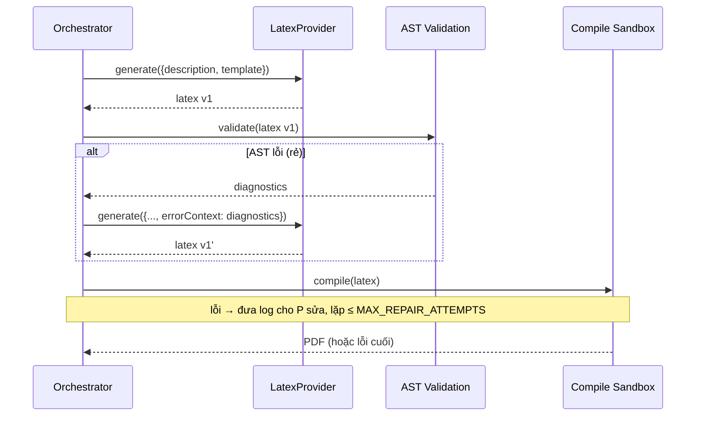

# 06 — Tích hợp AI

## 6.1. Nguyên tắc: Provider-agnostic

AI provider ẩn sau **một interface duy nhất**. Code nghiệp vụ (orchestrator) chỉ biết
interface, không biết đó là Claude, GPT hay Mock. Đổi provider = đổi biến môi trường.

```ts
// ai/types.ts
export interface ErrorContext {
  previousLatex: string;   // mã LaTeX lần trước (compile lỗi)
  errorLog: string;        // log lỗi từ Tectonic
}

export interface EditContext {
  currentLatex: string;    // mã LaTeX hiện tại của tài liệu
  instruction: string;     // chỉ thị chỉnh sửa (ngôn ngữ tự nhiên)
}

export interface GenerateInput {
  description: string;
  docType: 'article' | 'report';
  sources?: SourceFile[];        // tài liệu nguồn người dùng tải lên (dữ liệu tham khảo)
  errorContext?: ErrorContext;   // có => lượt sửa lỗi compile/validate
  editContext?: EditContext;     // có => lượt chỉnh sửa nội dung theo yêu cầu (chat-edit)
}

export interface LatexProvider {
  readonly name: string;
  generate(input: GenerateInput): Promise<{ latex: string }>;
}
```

```ts
// ai/factory.ts
export function getProvider(): LatexProvider {
  switch (process.env.AI_PROVIDER) {
    case 'anthropic': return new AnthropicProvider();
    case 'openai':    return new OpenAIProvider();
    case 'mock':      return new MockProvider();
    default:          throw new Error('AI_PROVIDER không hợp lệ');
  }
}
```

## 6.2. Các implementation

| Provider | Dùng cho | Ghi chú |
|----------|----------|---------|
| `MockProvider` | Test & dev offline | Trả LaTeX cố định; mô phỏng "lỗi lần 1 → đúng lần 2" để test repair loop |
| `AnthropicProvider` | Production (mặc định đề xuất) | Claude — sinh LaTeX cú pháp tốt |
| `OpenAIProvider` | Production (thay thế) | GPT-4-class |

Vì sao mặc định Claude/GPT: theo cộng đồng, các model lớn này sinh LaTeX hợp lệ tốt và
hiểu được log lỗi TeX để tự sửa.

> **QUYẾT ĐỊNH (đã chốt cho MVP)**: provider mặc định là **Anthropic Claude**
> (`AI_PROVIDER=anthropic`), model qua `AI_MODEL` (một model Claude hiện hành, vd họ
> `claude-sonnet`/`claude-opus`, chốt phiên bản cụ thể lúc lấy key). Lý do: chất lượng sinh LaTeX
> và khả năng đọc log lỗi TeX tốt trong thực tế cộng đồng. **`OpenAIProvider` là phương án thay thế
> đầy đủ ngang hàng** — nhờ Nguyên tắc V (provider-agnostic), đổi sang GPT chỉ cần đổi biến môi
> trường, không sửa code nghiệp vụ. Kiến trúc không khoá nhà cung cấp.

## 6.3. Thiết kế Prompt (template-first)

**Chiến lược chủ đạo: template-first.** Thay vì để LLM sinh toàn văn tự do, hệ thống cung cấp
**khung template** (article/report) làm "xương sống"; LLM chỉ điền nội dung vào các slot
(title, abstract, sections, kết luận...). Cách này cho kết quả **ổn định hơn**, giảm variance,
giảm chi phí đánh giá, và tăng tỷ lệ compile được. Template phổ biến/an toàn (Quarto, Manubot,
Overleaf gallery đều theo hướng này).

### 6.3.1. System prompt (cố định)
Định hình vai trò và ràng buộc đầu ra. Ý chính:

```
Bạn là chuyên gia LaTeX. Nhiệm vụ: từ mô tả của người dùng, sinh ra MỘT tài liệu LaTeX
HOÀN CHỈNH và CÓ THỂ COMPILE bằng Tectonic.

Quy tắc bắt buộc:
- Trả về CHỈ mã LaTeX, không giải thích, không markdown fence.
- Tài liệu phải đầy đủ: \documentclass{...} ... \begin{document} ... \end{document}.
- Chỉ dùng package phổ biến, có trên CTAN (Tectonic tự tải).
- KHÔNG dùng \write18 / shell-escape / lệnh đọc-ghi file ngoài.
- Ưu tiên cú pháp an toàn, biên dịch được; tránh package hiếm/khó tải.
- Dùng UTF-8. Tectonic dùng engine **XeTeX** nên hãy soạn tài liệu theo hướng **XeLaTeX**:
  dùng `fontspec` (và `polyglossia` khi cần đa ngôn ngữ) để xử lý Unicode/tiếng Việt trực tiếp.
  KHÔNG dùng `inputenc`/`fontenc` kiểu pdfLaTeX (không cần và có thể gây lỗi với XeTeX).
```

> **QUYẾT ĐỊNH (đã chốt cho MVP — xem NFR-6.1)**: engine mặc định là **XeLaTeX** (chính là engine
> XeTeX mà Tectonic dùng mặc định). Xử lý tiếng Việt/Unicode bằng **`fontspec`** (+ `polyglossia`
> khi cần), chọn font hỗ trợ tiếng Việt (vd Latin Modern/DejaVu/TeX Gyre). Lý do: Tectonic dựa trên
> XeTeX → Unicode là công dân hạng nhất, không phải cấu hình `inputenc` mong manh của pdfLaTeX.
> pdfLaTeX + `inputenc`/`babel` **không** phải đường đi mặc định ở MVP.

### 6.3.2. User prompt (theo docType) — lượt đầu
```
Loại tài liệu: {docType}   (article | report)
Mô tả của người dùng:
"""
{description}
"""
Hãy sinh tài liệu LaTeX hoàn chỉnh tương ứng.
```

Có thể kèm **gợi ý cấu trúc** theo docType:
- `article`: title, author, abstract (nếu hợp lý), các `\section`, kết luận, (tuỳ chọn) references.
- `report`: title page, các `\chapter`, mỗi chapter có `\section`, phần mở đầu/kết luận.

### 6.3.3. Repair prompt — khi có `errorContext`
`errorContext` có thể đến từ **AST validation** (chẩn đoán parser) hoặc **compile** (log Tectonic):
```
Mã LaTeX dưới đây KHÔNG hợp lệ (lỗi parser) hoặc compile LỖI bằng Tectonic.
Hãy SỬA để hợp lệ và compile thành công, giữ nguyên ý đồ nội dung và template.
Chỉ trả về mã LaTeX đã sửa hoàn chỉnh.

--- LaTeX hiện tại ---
{previousLatex}

--- Chẩn đoán (AST) / Log lỗi (Tectonic) ---
{diagnostics | errorLog (đã rút gọn quanh dòng lỗi)}
```

### 6.3.4. Edit prompt — khi có `editContext` (chat-edit)
Khi người dùng yêu cầu chỉnh sửa một tài liệu **đã có** (qua `/api/documents/[id]/chat`), provider
nhận `editContext = { currentLatex, instruction }` và trả về **toàn bộ tài liệu đã cập nhật**:
```
Đây là một tài liệu LaTeX ĐÃ CÓ. Người dùng muốn CHỈNH SỬA nội dung theo yêu cầu bên dưới.
Hãy áp dụng yêu cầu và trả về TOÀN BỘ tài liệu LaTeX ĐÃ CẬP NHẬT, hoàn chỉnh và compile được.
Giữ nguyên các phần KHÔNG liên quan đến yêu cầu; chỉ thay đổi những gì cần thiết.
Chỉ trả về mã LaTeX, KHÔNG giải thích, KHÔNG markdown fence.

--- YÊU CẦU CHỈNH SỬA (chỉ thị của người dùng) ---
{instruction}

--- TÀI LIỆU LATEX HIỆN TẠI ---
{currentLatex}
```
Sau lượt edit, nếu validate/compile lỗi thì tiếp tục dùng **repair prompt** (§6.3.3) để tự sửa,
vẫn giới hạn bởi `MAX_REPAIR_ATTEMPTS`. Xem `runEdit` ở [05-backend.md](./05-backend.md) §5.11.5.

### 6.3.5. Danh mục template theo dạng tài liệu (`lib/templates/registry.ts`)
Người dùng chọn một **template cụ thể**; mỗi template định hình `documentClass` nền, gói LaTeX gợi ý,
và **hướng dẫn cấu trúc/format** (`promptGuidance`) được chèn vào user prompt (thay cho structureHint
theo docType). Đăng ký hiện có:

| `TemplateId` | Dạng | Lớp nền | Gói tiêu biểu |
|--------------|------|---------|---------------|
| `general` | Báo cáo thường (thuần văn bản) | article | geometry |
| `academic` | Bài báo học thuật (abstract + refs) | article | amsmath, graphicx, hyperref |
| `math` | Tài liệu Toán học (định lý/chứng minh) | article | amsmath, amssymb, amsthm, mathtools |
| `physics` | Tài liệu Vật lý (công thức, đơn vị SI, hình) | article | siunitx, graphicx, tikz |
| `technical` | Báo cáo kỹ thuật (bảng, sơ đồ, mã) | article | booktabs, tikz, listings |
| `thesis` | Luận văn/Báo cáo dài (nhiều chương) | report | amsmath, graphicx, hyperref |

Ràng buộc an toàn compile: hình minh hoạ vẽ bằng **TikZ**/placeholder, **không** `\includegraphics`
file ngoài (không tồn tại trong sandbox). Mỗi template cũng cung cấp khung LaTeX mẫu hợp lệ
(`renderMock`) cho `MockProvider`/dev offline. Nếu chỉ có `docType` (tương thích ngược), template
mặc định được suy ra: `report→thesis`, còn lại `→general`.

## 6.4. Vòng lặp generate → validate → compile → patch

Logic điều phối ở `/api/document` (xem [05-backend.md](./05-backend.md)). Có **2 lớp canh gác**
trước khi chấp nhận output: AST validation (rẻ, bắt lỗi cấu trúc sớm) rồi compile (nguồn sự thật cuối).



**Điểm thiết kế quan trọng**
- Cùng một method `generate()` xử lý lượt đầu lẫn lượt sửa, phân biệt bằng `errorContext`
  (`errorContext` chứa `previousLatex` + `diagnostics` **hoặc** `errorLog`).
- **AST validation trước compile**: bắt lỗi cấu trúc (môi trường hở, cặp lệnh sai) **rẻ và nhanh**,
  tiết kiệm một lượt compile. Đây là lớp "parser kiểm" trong châm ngôn.
- AST là **best-effort** (LaTeX Turing-complete): compiler vẫn là nguồn sự thật vận hành cuối.
- **Rút gọn log** trước khi đưa vào prompt: chỉ giữ phần quanh dòng báo lỗi (`! LaTeX Error`, `l.<số dòng>`).
- Giới hạn số lần lặp (`MAX_REPAIR_ATTEMPTS`) để chặn vòng lặp vô hạn & kiểm soát chi phí.

## 6.5. Hậu xử lý output của AI (sanitize)

Dù prompt yêu cầu "chỉ trả mã LaTeX", model đôi khi vẫn kèm rác. Cần bước làm sạch:
- Bóc bỏ ```` ```latex ```` / ```` ``` ```` fences nếu có.
- Cắt phần văn xuôi thừa trước `\documentclass` / sau `\end{document}` nếu phát hiện.
- Kiểm tra tối thiểu: có `\documentclass`, có `\begin{document}` và `\end{document}`.
  Nếu thiếu → coi như output không hợp lệ (có thể thử lại hoặc báo lỗi).

## 6.6. Độ tin cậy & chi phí

- **Timeout** mỗi lời gọi AI (`REQUEST_TIMEOUT_MS`); bắt lỗi mạng/quá tải → trả `502`.
- **Token**: rút gọn log + giới hạn độ dài mô tả để kiểm soát chi phí.
- **Tính không xác định (non-determinism)**: đặt nhiệt độ (temperature) thấp để output ổn định,
  dễ compile hơn. **QUYẾT ĐỊNH (đã chốt)**: `temperature = 0.2` mặc định (đủ thấp để ổn định/dễ
  compile, vẫn cho phép chút linh hoạt về diễn đạt nội dung); cấu hình được qua env nếu cần tinh chỉnh.
- **Bảo mật**: API key chỉ ở server; không bao giờ gửi key/khoá ra client; không log secret.

## 6.7. Kiểm thử AI layer

- `MockProvider` cho phép test toàn bộ orchestrator **không tốn tiền/không phụ thuộc mạng**:
  - kịch bản trả LaTeX hợp lệ ngay (happy path).
  - kịch bản trả LaTeX lỗi lần 1, hợp lệ lần 2 (test repair loop hội tụ).
  - kịch bản luôn lỗi (test dừng đúng `MAX_REPAIR_ATTEMPTS`).
- Test `factory` chọn đúng provider theo env và ném lỗi khi `AI_PROVIDER` sai.
- Test bước sanitize: bóc fence, phát hiện thiếu `\documentclass`.
- Với provider thật: test hợp đồng (contract) tối thiểu, có thể đánh dấu skip nếu thiếu key,
  tránh phụ thuộc mạng trong CI.

## 6.8. Chống hallucination & grounding (định hướng v1)

Trong ngữ cảnh LaTeX, hallucination không chỉ là "bịa facts" mà còn là **bịa package, bịa option,
bịa BibTeX entry, bịa citation key, bịa cách dùng macro**. Biện pháp:

- **MVP**: prompt chặt (chỉ package phổ biến), template-first, AST validation + compile loop để
  "lọc" output sai. Đây là grounding gián tiếp qua công cụ (parser + compiler).
- **v1 — RAG (Retrieval-Augmented Generation)**: gắn LLM với kho ngoài để **grounding**:
  1. **Template/project hiện có** — bám cấu trúc/phong cách.
  2. **Tài liệu package/class** — dùng macro/option đúng.
  3. **Style guide / journal rules** — đúng venue.
  4. **Project memory** — nhất quán giữa các lần sửa.
  RAG đặc biệt hữu ích vì đúng/sai trong LaTeX phụ thuộc môi trường cục bộ hơn tri thức chung.
- **Bảo mật RAG**: khi đọc README/comments/package docs/BibTeX/file upload, phải **tách "dữ liệu"
  khỏi "lệnh"** (chống prompt injection): content sanitization, provenance tagging,
  prompt compartmentalization, policy ở tool layer (xem NFR-2.7 ở [02](./02-requirements.md)).

## 6.9. Grammar-constrained decoding (tùy chọn nâng cao)

Vì đầu ra LaTeX có cấu trúc cú pháp chặt, có thể dùng **grammar-constrained decoding** để ép token
đầu ra theo cấu trúc hợp lệ hơn (giảm lỗi cú pháp ngay từ lúc sinh). Đây là hướng nâng cao,
phụ thuộc khả năng của provider; cân nhắc ở v1/v2 khi cần tăng parse-pass rate.

## 6.10. Fine-tuning (định hướng v2 — chỉ cho tác vụ hẹp)

Fine-tuning **không** ưu tiên cho sinh tài liệu tổng quát (prompt + RAG + loop là đủ và linh hoạt hơn).
Nó chỉ đáng đầu tư cho **tác vụ hẹp, format ổn định**: OCR công thức/bảng → LaTeX (im2latex, pix2tex,
Nougat), hoặc giữ phong cách của một corpus template nội bộ. Lưu ý quản trị nguồn dữ liệu training
(rủi ro bản quyền — xem NFR-8).
