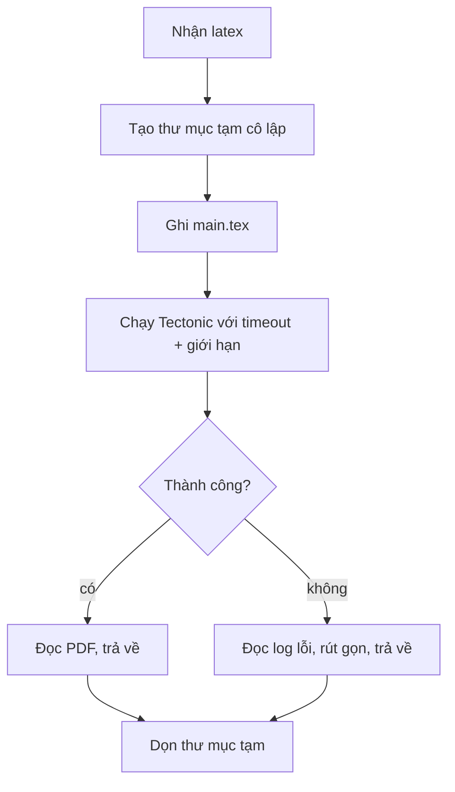

# 07 — Compile Service (Tectonic + Docker)

## 7.1. Vai trò

Microservice độc lập nhận mã LaTeX, compile bằng **Tectonic** và trả về **PDF** (khi thành công)
hoặc **log lỗi** (khi thất bại). Tách riêng khỏi Next.js để:
- Cô lập bảo mật (chạy binary TeX với input tùy ý của người dùng).
- Scale độc lập với app web.
- Đóng gói môi trường TeX gọn trong một image Docker.

## 7.2. Vì sao Tectonic

- **Tự tải package** từ CTAN khi cần → không phải cài cả TeX Live khổng lồ.
- **Compile thông minh**: tự chạy đủ số pass, xử lý BibTeX/biber, cross-reference.
- Một binary, dễ đóng gói Docker, phù hợp môi trường server.
- Có **bundle cache**: lần compile sau nhanh hơn nhờ package đã tải.
- **Chế độ `--untrusted`**: Tectonic hỗ trợ cờ `--untrusted` để compile input **không tin cậy**,
  vô hiệu hóa các tính năng nguy hiểm (shell-escape, đọc/ghi file tùy tiện). **Bắt buộc bật** vì
  ta nhận LaTeX tùy ý từ người dùng. Tectonic cũng có `--synctex`, `--only-cached` cho các nhu cầu khác.

## 7.3. API của compile service

### `POST /compile`
**Request**
```json
{ "latex": "\\documentclass{article}\n..." }
```

**Response — thành công** `200`
- `Content-Type: application/pdf`
- body: bytes PDF.

> **QUYẾT ĐỊNH (đã chốt cho MVP — xem [11-data-model.md](./11-data-model.md) §11.5)**: compile
> service `POST /compile` trả **PDF binary** (`application/pdf`) khi thành công. Việc bọc base64/JSON
> để trả cho UI là trách nhiệm của `/api/document` ở tầng Next.js, không phải compile service.

**Response — compile lỗi** `200` hoặc `422`
```json
{ "success": false, "log": "! LaTeX Error: ... \nl.42 ..." }
```

**Response — lỗi hệ thống** `500` (Tectonic không chạy được, hết tài nguyên...).

### `GET /health`
Trả `200 OK` để health check trong docker-compose / orchestrator.

## 7.4. Luồng xử lý một request compile



Chi tiết:
1. Tạo thư mục tạm **riêng cho mỗi request** (vd `/tmp/compile/<uuid>`).
2. Ghi `main.tex` chứa LaTeX nhận được.
3. Gọi Tectonic compile ở **chế độ untrusted** (vd `tectonic -X compile --untrusted main.tex --outdir <dir>`
   hoặc API tương ứng), **kèm timeout** (vd 30–60s).
4. Nếu có `main.pdf` → đọc và trả về; nếu không → đọc log lỗi.
5. **Luôn dọn** thư mục tạm (kể cả khi lỗi/timeout) trong `finally`.

## 7.5. Bảo mật (RẤT QUAN TRỌNG)

Compile service chạy **binary TeX trên input tùy ý từ Internet** → bề mặt tấn công lớn.
Đây là **tiêu chí chất lượng ngang hàng với compilability**, không phải "thêm cho có".

### Phòng thủ nhiều lớp (defense-in-depth)

| Rủi ro | Biện pháp |
|--------|-----------|
| Shell-escape / chạy lệnh tùy ý (`\write18`) | Bật **`tectonic --untrusted`**; **KHÔNG bật** `--shell-escape`. |
| **Lỗ hổng LuaTeX** | TeX Live từng công bố lỗ hổng LuaTeX cho phép thực thi shell command **ngay cả khi shell-escape tắt** → **không** dựa duy nhất vào cờ; bắt buộc cô lập container. |
| Đọc/ghi file ngoài | Thư mục tạm cô lập; user **non-root**; filesystem read-only ngoài thư mục tạm. |
| Chiếm CPU/treo (loop trong TeX) | **Timeout** cứng; kill process khi quá hạn. |
| Cạn RAM/disk | Giới hạn tài nguyên container (memory/CPU/pids); giới hạn kích thước output. |
| Input khổng lồ | Giới hạn kích thước `latex` đầu vào (`MAX_LATEX_BYTES`). |
| Truy cập mạng ngoài ý muốn | Tectonic cần tải package CTAN → **prefetch/cache bundle** sẵn trong image để hạn chế mạng lúc chạy; cân nhắc `--only-cached`. |
| Lộ thông tin qua log | Rút gọn log trả về; không trả đường dẫn hệ thống nhạy cảm. |

### Mô hình tham chiếu: Overleaf sandboxed compiles
Overleaf compile mỗi project trong **container riêng (sandboxed compiles)** và cảnh báo rõ rằng
compile **không sandbox** chỉ phù hợp khi người dùng **hoàn toàn tin cậy**. Ta áp dụng nguyên tắc
cô lập tương tự: mỗi request compile chạy trong môi trường cô lập, non-root, có giới hạn tài nguyên.

Nguyên tắc: container **non-root**, **read-only filesystem** (trừ thư mục tạm),
**không expose ra Internet** (chỉ Next.js gọi nội bộ), và **không tin cậy input**.

## 7.6. Dockerfile (phác thảo)

```dockerfile
# Phác thảo — chi tiết version chốt khi code
FROM node:20-slim

# Cài Tectonic (qua binary release hoặc package manager phù hợp)
# + chứng chỉ CA để tải bundle từ CTAN
RUN apt-get update \
 && apt-get install -y --no-install-recommends ca-certificates curl \
 && curl -sL <tectonic-release-url> -o /usr/local/bin/tectonic \
 && chmod +x /usr/local/bin/tectonic \
 && rm -rf /var/lib/apt/lists/*

# Tạo user non-root
RUN useradd --create-home appuser
WORKDIR /app
COPY package*.json ./
RUN npm ci --omit=dev
COPY . .

USER appuser
EXPOSE 8080
CMD ["node", "server.js"]
```

> Lưu ý: cách cài Tectonic (URL/phiên bản, hoặc dùng image có sẵn TeX) sẽ chốt khi triển khai.
> Cân nhắc **prefetch bundle** lúc build image để compile lần đầu không phải chờ tải package.

## 7.7. Tối ưu hiệu năng

- **Cache bundle Tectonic** ở volume bền vững → tránh tải lại package mỗi container/restart.
- **Warm-up**: compile một tài liệu mẫu lúc khởi động để mồi cache.
- Cân nhắc hàng đợi/giới hạn số compile đồng thời để tránh quá tải CPU.

## 7.8. Cấu hình

| Biến | Ý nghĩa | Ví dụ |
|------|---------|-------|
| `PORT` | Cổng service | `8080` |
| `COMPILE_TIMEOUT_MS` | Timeout mỗi lần compile | `45000` |
| `MAX_LATEX_BYTES` | Giới hạn kích thước input | `1000000` |
| `WORK_DIR` | Thư mục tạm gốc | `/tmp/compile` |
| `TECTONIC_CACHE_DIR` | Thư mục cache bundle | `/var/cache/tectonic` |

## 7.9. Tích hợp trong docker-compose

```yaml
# Phác thảo
services:
  next-app:
    build: .
    ports: ["3000:3000"]
    environment:
      - COMPILE_SERVICE_URL=http://compile-service:8080
      - AI_PROVIDER=${AI_PROVIDER}
      - AI_API_KEY=${AI_API_KEY}
      - MAX_REPAIR_ATTEMPTS=3
    depends_on:
      - compile-service

  compile-service:
    build: ./compile-service
    # KHÔNG mở ports ra ngoài — chỉ truy cập nội bộ
    expose: ["8080"]
    read_only: true
    tmpfs:
      - /tmp/compile
    volumes:
      - tectonic-cache:/var/cache/tectonic
    # giới hạn tài nguyên (mem/cpu) tuỳ runtime

volumes:
  tectonic-cache:
```

## 7.10. Kiểm thử compile service

- **Integration**: gửi LaTeX hợp lệ → nhận PDF (kiểm magic bytes `%PDF-`).
- **Integration lỗi**: gửi LaTeX sai cú pháp → nhận `success:false` + log chứa `! LaTeX Error`/`! `.
- **Timeout**: gửi LaTeX gây vòng lặp/biên dịch lâu → service kill và trả lỗi đúng hạn.
- **Dọn dẹp**: sau nhiều request, thư mục tạm không tích tụ rác.
- **Bảo mật**: xác nhận `--shell-escape` không bật; thử `\write18` phải bị từ chối.
- **/health**: trả 200.
