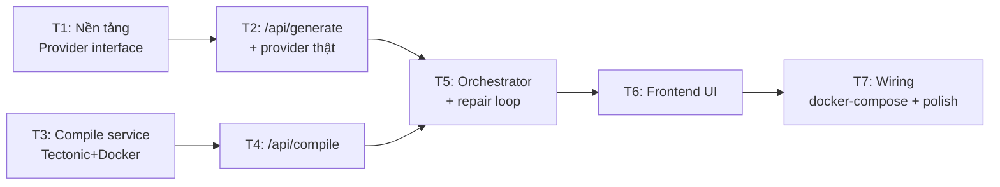

# 08 — Roadmap & Task Breakdown

Triển khai theo hướng **test-driven** và **incremental**: mỗi task cho ra một phần
chạy được/demo được, kết thúc bằng việc ghép mọi thứ lại. Không để code "mồ côi".

## 8.0. Roadmap phân tầng (MVP / v1 / v2)

Ước lượng giả định **nhóm nhỏ 1–2 devs**, phạm vi web-first. Mục tiêu xuyên suốt: vòng lặp
**generate → validate → compile → patch** ổn định trước, rồi mới mở rộng.

| Giai đoạn | Ước lượng | Deliverables chính |
|-----------|----------:|--------------------|
| **MVP** | 4–6 tuần | Editor web cơ bản; prompt → `article`/`report` (template-first); AST validation; compile sandbox Tectonic `--untrusted`; PDF preview + logs; vòng lặp tự sửa; 10–20 template chuẩn; smoke test cho 8 ca chính ([09](./09-evaluation.md)) |
| **v1** | 6–8 tuần | RAG trên template/package docs/project files; **patch project có sẵn**; **Markdown→LaTeX** (Pandoc); BibTeX helper; AST validation mạnh hơn; metrics dashboard; hardening security cơ bản |
| **v2** | 8–10 tuần | Agentic editing đa file; package/engine optimization; **multilingual** (CJK/RTL) hạng nhất; **OCR công thức**; CI regression + visual diff; team/project workspace; **self-host/local-first** (beta) |

**Triết lý**: MVP không nhằm "AI thật thông minh" mà nhằm chứng minh **một vòng khép kín**:
sinh được, validate được, compile được, preview được, tự sửa lỗi cơ bản. Chỉ cần 2–3 template +
prompt tốt + compile sandbox là đủ kiểm nghiệm product-market fit. RAG và fine-tuning để **sau**.

> Phần §8.1–§8.4 dưới đây là **chi tiết task breakdown của giai đoạn MVP**.

## 8.1. Thứ tự task (MVP)

> T1→T2 và T3→T4 là hai nhánh **song song được** (AI và compile độc lập), gặp nhau ở T5.

## 8.2. Chi tiết task

### Task 1 — Nền tảng: AI provider interface + cấu hình + test harness
- **Mục tiêu**: `LatexProvider` interface; `getProvider()` factory đọc env; `MockProvider`
  trả LaTeX cố định; thiết lập Vitest; types `DocType`, `GenerateInput`, `CompileResult`.
- **Test**: unit test MockProvider qua interface; test factory chọn đúng theo env & lỗi khi sai.
- **Demo**: `npm test` xanh; gọi MockProvider trả LaTeX hợp lệ.
- **Tham chiếu**: [06-ai-integration.md](./06-ai-integration.md).

### Task 2 — `/api/generate` + 1 provider thật
- **Mục tiêu**: hiện thực `AnthropicProvider` (hoặc `OpenAIProvider`) sau interface; route
  `/api/generate` nhận `{ description, docType }` → `{ latex }`; system/user prompt; validate input;
  xử lý lỗi provider (timeout/rate limit).
- **Test**: route test với `MockProvider` (inject) — validate input, shape response, nhánh lỗi.
- **Demo**: `curl -X POST /api/generate` → nhận LaTeX article hợp lệ.
- **Tham chiếu**: [05-backend.md](./05-backend.md) §5.3, [06-ai-integration.md](./06-ai-integration.md).

### Task 3 — Compile service (Tectonic trong Docker)
- **Mục tiêu**: microservice Node + Express; `POST /compile` → PDF hoặc `{success:false, log}`;
  `GET /health`; thư mục tạm cô lập + dọn dẹp; timeout; **non-root, sandbox, không shell-escape**;
  Dockerfile cài Tectonic.
- **Test**: integration — LaTeX hợp lệ → PDF (`%PDF-`); LaTeX lỗi → log; timeout; dọn dẹp; `/health`.
- **Demo**: `docker build` + `docker run`, POST LaTeX → nhận PDF mở được.
- **Tham chiếu**: [07-compile-service.md](./07-compile-service.md).

### Task 4 — `/api/compile` (Next.js gọi compile service)
- **Mục tiêu**: route nhận `{ latex }` → gọi `COMPILE_SERVICE_URL/compile` → trả PDF hoặc log;
  xử lý lỗi mạng/timeout.
- **Test**: route test với compile service **mock** — case PDF, case log lỗi, case service chết.
- **Demo**: `curl /api/compile` với LaTeX hợp lệ → tải về PDF.
- **Tham chiếu**: [05-backend.md](./05-backend.md) §5.4.

### Task 5 — AST validation + Orchestrator + repair loop (`/api/document`)
- **Mục tiêu**: thêm **lớp AST validation** (tree-sitter-latex / unified-latex / latex-utensils) kiểm
  mã LaTeX **trước compile**; ghép generate → **validate** → compile → patch (tối đa `MAX_REPAIR_ATTEMPTS`);
  trả `{ latex, pdfBase64, attempts, metadata }` hoặc `{ error, latex, log, attempts }`.
- **Cài đặt**: module `validateLatex(latex) → { ok, diagnostics }`; orchestrator dùng diagnostics (rẻ)
  trước rồi mới tới compile log; `errorContext` mang `previousLatex` + `diagnostics|errorLog`.
- **Test**: với `MockProvider` mô phỏng "AST lỗi → sửa" và "compile lỗi lần 1 → đúng lần 2" + compile mock →
  happy (attempts=1), AST-repair, compile-repair (attempts=2), fail (attempts=N).
- **Demo**: `curl /api/document` mô tả "khó" → log cho thấy bắt lỗi AST sớm và/hoặc tự sửa, trả PDF.
- **Tham chiếu**: [05-backend.md](./05-backend.md) §5.5, [06-ai-integration.md](./06-ai-integration.md) §6.4.

### Task 6 — Frontend UI
- **Mục tiêu**: thay `app/page.tsx`; `GeneratorForm` (docType + textarea + submit); `ResultPanel`
  (tab PDF | source, download); `StatusBanner`; gọi `/api/document`; xử lý loading/success/error;
  hiển thị `attempts`.
- **Test**: component test (RTL) — submit gọi API đúng payload; render PDF khi success; hiện lỗi
  khi fail; chặn submit khi rỗng (fetch mock).
- **Demo**: mở trình duyệt → nhập mô tả → thấy PDF render + tải về.
- **Tham chiếu**: [04-frontend.md](./04-frontend.md).

### Task 7 — Wiring & hoàn thiện
- **Mục tiêu**: `docker-compose.yml` chạy cả Next.js + compile service (service nội bộ, không expose);
  `.env.example`; rate limiting cơ bản; thông báo lỗi thân thiện; cập nhật README cách chạy.
- **Test**: smoke end-to-end — mô tả → PDF qua toàn stack; test rate limit chặn quá ngưỡng.
- **Demo**: `docker compose up` → vào localhost → mô tả → PDF hoàn chỉnh.
- **Tham chiếu**: [03-architecture.md](./03-architecture.md) §3.6, [07-compile-service.md](./07-compile-service.md) §7.9.

## 8.3. Định nghĩa "Done" (mỗi task)

- Có test cho phần logic mới và **test xanh**.
- Build/lint không lỗi.
- Có thể demo phần tăng trưởng (chạy được, không phải code chết).
- Không làm vỡ phần trước đó.

## 8.4. Rủi ro & giảm thiểu

| Rủi ro | Giảm thiểu |
|--------|-----------|
| Đóng gói Tectonic trong Docker phức tạp | Làm sớm ở T3; cân nhắc image có sẵn TeX; prefetch bundle |
| AI sinh LaTeX khó compile / hallucinate package | AST validation + repair loop (T5) + template-first + sanitize; (v1) RAG grounding |
| Chi phí gọi AI khi test | `MockProvider` cho hầu hết test; provider thật chỉ smoke/contract |
| Bảo mật compile (input tùy ý) | Non-root, sandbox, timeout, resource limit, **`--untrusted`**, không shell-escape (T3); lưu ý lỗ hổng LuaTeX |
| LaTeX không parse hoàn hảo (Turing-complete) | AST chỉ là lớp canh gác best-effort; compiler là nguồn sự thật cuối |
| Prompt injection (khi có RAG ở v1) | Tách dữ liệu/lệnh, sanitization, provenance tagging, policy tool layer |
| Thời gian phản hồi lâu (AI+compile) | Loading rõ ràng; (sau) streaming tiến trình |

## 8.5. Hướng mở rộng sau MVP

Chi tiết theo giai đoạn xem **§8.0 (roadmap phân tầng)**. Tóm tắt:

**v1**
- **RAG** trên template/package docs/project files (grounding, giảm hallucination).
- **Markdown→LaTeX** (Pandoc); BibTeX/citation helper.
- **Chỉnh sửa project có sẵn** theo phong cách hiện tại (diff tối thiểu).
- Metrics dashboard (compile success rate, parse-pass rate — xem [09](./09-evaluation.md)).
- Editor LaTeX trong app cho phép chỉnh & re-compile; streaming tiến trình (SSE).

**v2**
- Thêm template: Beamer slides, thesis, letter, CV, book.
- **OCR** ảnh/handwriting công thức/bảng → LaTeX.
- **Multilingual** hạng nhất (CJK/RTL) + chọn engine tự động (XeLaTeX/LuaLaTeX).
- Agentic editing đa file; package/engine optimization.
- CI regression + visual diff; team workspace; **self-host/local-first**.
- Tài khoản người dùng + lưu/quản lý lịch sử (DB + auth); export Overleaf; chia sẻ link.
- Rate limit/Cache phân tán (Redis) khi scale nhiều instance.
