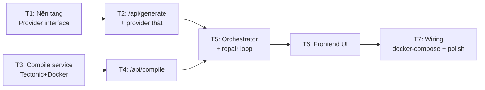

# 08 — Roadmap & Task Breakdown

Triển khai theo hướng **test-driven** và **incremental**: mỗi task cho ra một phần
chạy được/demo được, kết thúc bằng việc ghép mọi thứ lại. Không để code "mồ côi".

## 8.1. Thứ tự task

> T1→T2 và T3→T4 là hai nhánh **song song được** (AI và compile độc lập), gặp nhau ở T5.

## 8.2. Chi tiết task

### Task 1 — Nền tảng: AI provider interface + cấu hình + test harness
- **Mục tiêu**: `LatexProvider` interface; `getProvider()` factory đọc env; `MockProvider`
  trả LaTeX cố định; thiết lập Vitest; types `DocType`, `GenerateInput`, `CompileResult`.
- **Test**: unit test MockProvider qua interface; test factory chọn đúng theo env & lỗi khi sai.
- **Demo**: `npm test` xanh; gọi MockProvider trả LaTeX hợp lệ.
- **Tham chiếu**: [06-ai-integration.md](./06-ai-integration.md).

### Task 2 — `/api/generate` + 1 provider thật
- **Mục tiêu**: hiện thực `AnthropicProvider` (hoặc `OpenAIProvider`) sau interface; route
  `/api/generate` nhận `{ description, docType }` → `{ latex }`; system/user prompt; validate input;
  xử lý lỗi provider (timeout/rate limit).
- **Test**: route test với `MockProvider` (inject) — validate input, shape response, nhánh lỗi.
- **Demo**: `curl -X POST /api/generate` → nhận LaTeX article hợp lệ.
- **Tham chiếu**: [05-backend.md](./05-backend.md) §5.3, [06-ai-integration.md](./06-ai-integration.md).

### Task 3 — Compile service (Tectonic trong Docker)
- **Mục tiêu**: microservice Node + Express; `POST /compile` → PDF hoặc `{success:false, log}`;
  `GET /health`; thư mục tạm cô lập + dọn dẹp; timeout; **non-root, sandbox, không shell-escape**;
  Dockerfile cài Tectonic.
- **Test**: integration — LaTeX hợp lệ → PDF (`%PDF-`); LaTeX lỗi → log; timeout; dọn dẹp; `/health`.
- **Demo**: `docker build` + `docker run`, POST LaTeX → nhận PDF mở được.
- **Tham chiếu**: [07-compile-service.md](./07-compile-service.md).

### Task 4 — `/api/compile` (Next.js gọi compile service)
- **Mục tiêu**: route nhận `{ latex }` → gọi `COMPILE_SERVICE_URL/compile` → trả PDF hoặc log;
  xử lý lỗi mạng/timeout.
- **Test**: route test với compile service **mock** — case PDF, case log lỗi, case service chết.
- **Demo**: `curl /api/compile` với LaTeX hợp lệ → tải về PDF.
- **Tham chiếu**: [05-backend.md](./05-backend.md) §5.4.

### Task 5 — Orchestrator + repair loop (`/api/document`)
- **Mục tiêu**: ghép generate + compile + vòng lặp sửa lỗi (tối đa `MAX_REPAIR_ATTEMPTS`);
  trả `{ latex, pdfBase64, attempts }` hoặc `{ error, latex, log, attempts }`.
- **Test**: với `MockProvider` mô phỏng "lỗi lần 1 → đúng lần 2" + compile mock →
  happy (attempts=1), repair (attempts=2), fail (attempts=N).
- **Demo**: `curl /api/document` mô tả "khó" → log cho thấy tự sửa và trả PDF.
- **Tham chiếu**: [05-backend.md](./05-backend.md) §5.5, [06-ai-integration.md](./06-ai-integration.md) §6.4.

### Task 6 — Frontend UI
- **Mục tiêu**: thay `app/page.tsx`; `GeneratorForm` (docType + textarea + submit); `ResultPanel`
  (tab PDF | source, download); `StatusBanner`; gọi `/api/document`; xử lý loading/success/error;
  hiển thị `attempts`.
- **Test**: component test (RTL) — submit gọi API đúng payload; render PDF khi success; hiện lỗi
  khi fail; chặn submit khi rỗng (fetch mock).
- **Demo**: mở trình duyệt → nhập mô tả → thấy PDF render + tải về.
- **Tham chiếu**: [04-frontend.md](./04-frontend.md).

### Task 7 — Wiring & hoàn thiện
- **Mục tiêu**: `docker-compose.yml` chạy cả Next.js + compile service (service nội bộ, không expose);
  `.env.example`; rate limiting cơ bản; thông báo lỗi thân thiện; cập nhật README cách chạy.
- **Test**: smoke end-to-end — mô tả → PDF qua toàn stack; test rate limit chặn quá ngưỡng.
- **Demo**: `docker compose up` → vào localhost → mô tả → PDF hoàn chỉnh.
- **Tham chiếu**: [03-architecture.md](./03-architecture.md) §3.6, [07-compile-service.md](./07-compile-service.md) §7.9.

## 8.3. Định nghĩa "Done" (mỗi task)

- Có test cho phần logic mới và **test xanh**.
- Build/lint không lỗi.
- Có thể demo phần tăng trưởng (chạy được, không phải code chết).
- Không làm vỡ phần trước đó.

## 8.4. Rủi ro & giảm thiểu

| Rủi ro | Giảm thiểu |
|--------|-----------|
| Đóng gói Tectonic trong Docker phức tạp | Làm sớm ở T3; cân nhắc image có sẵn TeX; prefetch bundle |
| AI sinh LaTeX khó compile | Repair loop (T5) + prompt chặt + sanitize output |
| Chi phí gọi AI khi test | `MockProvider` cho hầu hết test; provider thật chỉ smoke/contract |
| Bảo mật compile (input tùy ý) | Non-root, sandbox, timeout, resource limit, không shell-escape (T3) |
| Thời gian phản hồi lâu (AI+compile) | Loading rõ ràng; (sau) streaming tiến trình |

## 8.5. Hướng mở rộng sau MVP (không nằm trong phạm vi hiện tại)

- Tài khoản người dùng + lưu/quản lý lịch sử tài liệu (thêm DB + auth).
- Thêm loại tài liệu: Beamer slides, letter, CV, book — qua hệ thống template/prompt.
- OCR ảnh/handwriting → LaTeX.
- Editor LaTeX trong app cho phép chỉnh & re-compile trực tiếp.
- Streaming tiến trình (SSE) để hiển thị bước generate/compile/repair.
- Export sang Overleaf; chia sẻ link tài liệu.
- Rate limit/Cache phân tán (Redis) khi scale nhiều instance.
